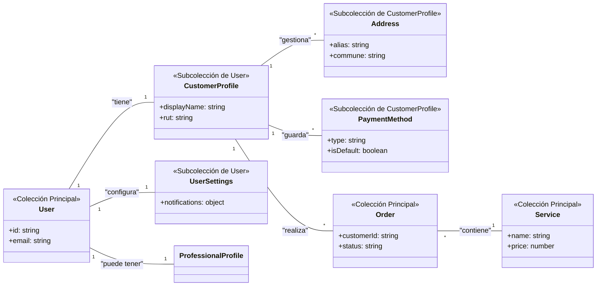

# 🛠️  Implementación de Perfiles de Clientes en LiliApp

## 📌 Visión General

LiliApp está evolucionando para incluir perfiles de clientes, permitiendo a los usuarios no solo registrarse, sino también comprar servicios y gestionar su experiencia en la aplicación de manera similar a MercadoLibre. Este documento describe las mejoras necesarias para habilitar esta funcionalidad, proporcionando detalles tanto para el equipo de UX/UI como para el de desarrollo.

## 🌟 ¿Qué queremos lograr?

En esta nueva etapa, vamos a habilitar el acceso a los **clientes finales**. El objetivo es que puedan registrarse, comprar servicios, gestionar sus pedidos y calificar a los profesionales directamente desde la aplicación, transformando a LiliApp en un marketplace de servicios completo.

Para lograrlo, implementaremos una nueva estructura en nuestra base de datos y diseñaremos flujos de usuario intuitivos, enfocados en la confianza y la facilidad de uso. Si ya tenemos una excelente experiencia para los **profesionales**, ahora es el turno de crear una experiencia igual de sólida para los **clientes**.

## 🎨 Guía para el Equipo de UX/UI

### Pantalla de Perfil de Usuario 

A continuación se detalla el flujo completo de registro e inicio de sesión, que guía el diseño de las pantallas posteriores.

```mermaid
graph LR
    title Tarea: Registro / Inicio de Sesión

    %% Definición de Nodos
    A(Home)
    B{Iniciar sesión}
    C[/Ingresar cuenta/]
    D[/Continuar con Google/]
    E[/Registrate/]
    F[(Base de datos)]
    G{¿Datos correctos?}
    H{Olvidé mi contraseña}
    I[/Recuperar contraseña/]
    J[(Base de datos)]
    K{¿Faltan datos?}
    L(Completar Perfil / Onboarding)
    M[(Validar datos)]
    N{Regresar atrás}
    O(Inicio exitoso)
    P(Home login)

    %% Conexiones del Flujo
    A --> B
    B --> C
    B --> D
    B --> E
    C -.-> F
    F --> G
    G -- Sí --> O
    G -- No --> H
    H -- Sí --> I
    H -- No --> C
    D -.-> J
    J --> K
    K -- No --> O
    K -- Sí --> L
    E --> L
    L -- Éxito --> O
    L -.-> M
    L -- No --> N
    N -- Sí --> B
    N -- No --> L
    O --> P
    
    %% Estilos basados en la leyenda oficial
    %% Inicio/Fin (Negro)
    style A fill:#2d2d2d,stroke:#333,color:#fff
    style P fill:#2d2d2d,stroke:#333,color:#fff
    
    %% Desición (Naranja)
    style B fill:#ffdec8,stroke:#f0a062,color:#333
    style G fill:#ffdec8,stroke:#f0a062,color:#333
    style H fill:#ffdec8,stroke:#f0a062,color:#333
    style K fill:#ffdec8,stroke:#f0a062,color:#333
    style N fill:#ffdec8,stroke:#f0a062,color:#333

    %% Accion (Azul)
    style C fill:#d5e8f8,stroke:#93c5ed,color:#333
    style D fill:#d5e8f8,stroke:#93c5ed,color:#333
    style E fill:#d5e8f8,stroke:#93c5ed,color:#333
    style I fill:#d5e8f8,stroke:#93c5ed,color:#333

    %% Pantallas (Morado)
    style L fill:#e9d5ff,stroke:#c084fc,color:#333
    style O fill:#e9d5ff,stroke:#c084fc,color:#333

    %% Base de datos (Amarillo)
    style F fill:#fef0b7,stroke:#f6d04d,color:#333
    style J fill:#fef0b7,stroke:#f6d04d,color:#333
    style M fill:#fef0b7,stroke:#f6d04d,color:#333

```


### Pantallas Principales

#### Pantalla de Crear una Cuenta

-   **Propósito**: Minimizar la fricción y permitir un registro rápido y sin obstáculos.
    
-   **Campos Esenciales**: Correo electrónico, Contraseña, Confirmar Contraseña, Checkbox para aceptar Términos y Condiciones.
    
-   **Campos Opcionales**: Checkbox para recibir promociones.
    
-   **Botones**: Crear Cuenta, Ya tengo una cuenta.
    
    - **Nota para UX**: Tras el registro, se debe diseñar un **flujo de onboarding** breve (representado como "Completar Perfil" en el diagrama) para incentivar al usuario a completar su perfil (nombre, RUT, primera dirección). Esto nos permitirá medir el KPI 'onboardingCompleted'. Los datos específicos de un servicio (como "Nombre de quien recibirá al profesional") se solicitarán durante el Pago (Checkout).
    

#### Pantalla de Inicio de Sesión

-   **Propósito**: Acceso rápido y sencillo para usuarios existentes.
    
-   **Campos**: Correo electrónico, Contraseña.
    
-   **Botones**: Iniciar sesión, **Continuar con Google**, Registrarse, ¿Olvidaste tu contraseña?.
    

#### Pantalla de Perfil de Usuario

-   **Propósito**: Centralizar toda la información y configuración del cliente, reflejando el modelo de datos.
    
-   **Secciones y flujo requeridos**: 
    -   Información Personal:
        - Formulario para editar: Nombre, Apellidos.
        - Campo para ingresar/validar RUT (con feedback visual para rutVerified).
    -  Mis Direcciones:
      - Vista de lista para las direcciones guardadas.
      - Botón para "Añadir Nueva Dirección" que abre un formulario con los campos: Alias, Calle, Número, Comuna, Región, Instrucciones Adicionales.
      - Opción para marcar una dirección como Principal.
    - Métodos de Pago:
      - Vista de lista para paymentMethods guardados (mostrando tipo y últimos 4 dígitos).
      - Botón para "Añadir Nuevo Método" (integración con pasarela de pago).
    - Configuración y Seguridad:
      - Switches para gestionar notificaciones (email, sms).
      - Switch para la privacidad del RUT (showRUT).
    - Mis Pedidos: Historial de servicios comprados (proveniente de la colección Orders). Al acceder, el usuario podrá:
      - Ver una lista separada de **Órdenes en Curso** y el **Historial de Órdenes**.
      - **Para órdenes en curso:** Ver el detalle para **cancelar**, **reagendar el servicio** o **solicitar asistencia**.
      - **Para órdenes completadas:** Ver el detalle para **añadir feedback (calificación)**, **descargar la boleta** o solicitar asistencia sobre un servicio pasado.

    
-   **Botones Principales**: Editar perfil, Añadir método de pago, Añadir dirección.
    

#### Pantalla de Catálogo de Servicios

-   **Propósito**: Facilitar el descubrimiento y la selección de servicios.
    
-   **Elementos**: Lista de servicios (imágenes, nombres, precios), Barra de búsqueda, Filtros por categorías.
    
-   **Botones**: Ver detalles, Agregar al carrito.
    

#### Pantalla de Detalles del Servicio

-   **Propósito**: Proporcionar toda la información para una decisión de compra informada.
    
-   **Elementos**: Galería de imágenes, Descripción detallada, Precio, Reseñas y calificaciones.
    
-   **Botones**: Agregar al carrito, Volver al catálogo.
    

#### Pantalla del Carrito de Compras

-   **Propósito**: Permitir al cliente revisar su selección antes de pagar.
    
-   **Elementos**: Lista de servicios en el carrito, Resumen del total.
    
-   **Botones**: Proceder al pago, Continuar comprando, Eliminar servicio.
    

#### Pantalla de Pago (Checkout)

-   **Propósito**: Un flujo de pago seguro, claro y eficiente.
    
-   **Elementos**: Resumen del pedido, Selección de dirección, Métodos de pago, Campo para datos de contacto en sitio.
    
-   **Botones**: Confirmar y pagar, Cancelar.
    

#### Pantalla de Confirmación de Orden

-   **Propósito**: Asegurar al cliente que su compra fue exitosa y guiarlo en los siguientes pasos.
    
-   **Elementos**: Mensaje de confirmación, Resumen de la orden, Información de próximos pasos.
    
-   **Botones**: Volver al inicio, Ver detalles de mi orden.
    

#### Pantalla de Mis Órdenes

-   **Propósito**: Permitir al usuario gestionar sus órdenes activas y consultar las pasadas.
-   **Elementos**:
    -   Pestañas o secciones para "En Curso" e "Historial".
    -   Lista de órdenes con información clave (nombre del servicio, fecha, estado).
-   **Acciones sobre órdenes en curso**:
    -   Botón para "Ver Detalle".
    -   Desde el detalle: opciones para **Cancelar Servicio** y **Reagendar Servicio** (ambas con un modal de confirmación: "¿Está seguro?").
    -   Opción para **Solicitar Asistencia**.
-   **Acciones sobre órdenes del historial**:
    -   Botón para "Ver Detalle".
    -   Desde el detalle: opciones para **Añadir Feedback**, **Descargar Boleta** y **Solicitar Asistencia**.
    

#### Pantalla de Reseñas y Calificaciones

-   **Propósito**: Recolectar feedback valioso sobre el servicio prestado.
    
-   **Campos**: Calificación por estrellas (1-5), Comentario (opcional).
    
-   **Botones**: Enviar reseña, Cancelar.
    
### Flujo de Gestión de Órdenes

El siguiente diagrama muestra el recorrido del usuario para consultar y gestionar sus órdenes activas e históricas.


```mermaid
graph LR
    title Tarea: Ver Mis órdenes

    %% Definiciones
    A(Home)
    B[/Log In / Registro/]
    C(Home Page)
    D(Perfil)
    E(Mis órdenes)
    F(Servicios en curso)
    G(Historial de servicios)
    H(Estado / Filtro)
    I[/Ver detalle/]
    J[/Cancelar servicio/]
    K[/Reagendar servicio/]
    L{¿Está seguro/a?}
    M{¿Está seguro/a? 2}
    N[/Seleccionar nuevo horario/]
    O[/Solicitar asistencia/]
    P[/Seleccionar servicio/]
    Q[/Ver detalle 2/]
    R[/Añadir feedback/]
    S[/Descargar boleta/]
    T[/Solicitar asistencia 2/]
    U(Fin)

    %% Conexiones
    subgraph "Flujo Principal"
        A --> B --> C --> D --> E
    end

    subgraph "Órdenes Activas"
        E --> F --> H --> I
        I --> J --> L
        L -- Sí --> U
        L -- No --> I
        I --> K --> M
        M -- Sí --> N --> U
        M -- No --> I
        I --> O --> U
    end

    subgraph "Órdenes Históricas"
        E --> G --> P --> Q
        Q --> R --> U
        Q --> S --> U
        P --> T --> U
    end

    %% Estilos (usando tu leyenda)
    style A fill:#2d2d2d,stroke:#333,color:#fff
    style U fill:#2d2d2d,stroke:#333,color:#fff
    style B fill:#d5e8f8,stroke:#93c5ed,color:#333
    style I fill:#d5e8f8,stroke:#93c5ed,color:#333
    style J fill:#d5e8f8,stroke:#93c5ed,color:#333
    style K fill:#d5e8f8,stroke:#93c5ed,color:#333
    style N fill:#d5e8f8,stroke:#93c5ed,color:#333
    style O fill:#d5e8f8,stroke:#93c5ed,color:#333
    style P fill:#d5e8f8,stroke:#93c5ed,color:#333
    style Q fill:#d5e8f8,stroke:#93c5ed,color:#333
    style R fill:#d5e8f8,stroke:#93c5ed,color:#333
    style S fill:#d5e8f8,stroke:#93c5ed,color:#333
    style T fill:#d5e8f8,stroke:#93c5ed,color:#333
    style C fill:#e9d5ff,stroke:#c084fc,color:#333
    style D fill:#e9d5ff,stroke:#c084fc,color:#333
    style E fill:#e9d5ff,stroke:#c084fc,color:#333
    style F fill:#e9d5ff,stroke:#c084fc,color:#333
    style G fill:#e9d5ff,stroke:#c084fc,color:#333
    style H fill:#e9d5ff,stroke:#c084fc,color:#333
    style L fill:#ffdec8,stroke:#f0a062,color:#333
    style M fill:#ffdec8,stroke:#f0a062,color:#333
```

---


##  💻Guía para el Equipo de Desarrollo  
### Modelo de Base de Datos  

#### 📁 Colección `users` 
```typescript
interface User {
  id: string; // Firebase UID
  email: string;
  phone: string; // +569XXXXXXXX
  emailVerified: boolean;
  phoneVerified: boolean;
  accountType: 'customer' | 'professional' | 'admin';
  accountStatus: 'pending' | 'verified' | 'suspended';
  
 
  // Campos para BI:
  onboardingCompleted: boolean; // ¿Completó el flujo inicial de perfil?
  acquisitionInfo?: {
    source?: string;   // 'google', 'facebook', 'referral'
    medium?: string;   // 'cpc', 'social', 'email'
    campaign?: string; // 'black-friday-2024'
    referredBy?: string; // userId de quien lo refirió
  };
  lastLoginAt: Timestamp; // Para calcular MAU
  createdAt: Timestamp; // Para cohortes
  
  isDeleted: boolean; // Borrado lógico
}
```

#### 📁 Subcolección `customer_profiles` (dentro de users/{userId})
```typescript
interface CustomerProfile {
  // Información básica
  firstName: string;
  lastName: string;
  displayName: string;
  rut?: string; // Formato 12.345.678-9
  rutVerified?: boolean; // Validado con servicio externo
  
  // Datos para BI:
  primaryAddressRegion?: string; // Copia de la región de la dirección principal
  lastServiceDate?: Timestamp;   // Para calcular Recencia (Recency)
  serviceHistoryCount: number;  // Para calcular Frecuencia (Frequency)
  totalSpending: number;        // Para calcular Valor Monetario (Monetary) 
    
  // Metadata interna
  metadata: {
    createdAt: Timestamp;
    updatedAt: Timestamp;
  };
}
```

#### 📍 Subcolección `addresses` (dentro de `customer_profiles/{profileId}`)
```typescript
interface Address {
  id: string;
  alias: string; // 'Casa', 'Oficina'
  street: string;
  number: string;
  commune: string;
  region: string;
  // --- CAMPOS PARA LOGÍSTICA Y BI ---
  zone?: 'norte' | 'sur' | 'oriente' | 'poniente' | 'centro'; // Agrupación logística
  communeCode?: string; // Código INE para normalización
  regionCode?: string;  // Código INE para normalización
  geo?: {
    lat: number;
    lng: number;
  };
  // --- FIN CAMPOS LOGÍSTICA Y BI ---
  isPrimary: boolean;
  additionalInstructions?: string;
  timesUsed: number;
}
```
#### 💳 Subcolección `payment_methods` (dentro de `customer_profiles/{profileId}`)
```typescript
interface PaymentMethod {
  id: string;
  type: 'credit_card' | 'debit_card' | 'webpay';
  lastFour?: string;
  bank?: 'bci' | 'santander' | 'chile' | 'estado';
  isDefault: boolean;
}
```


#### 📁 Subcolección `professional_profiles` (dentro de users/{userId})
```typescript
interface ProfessionalProfile {
  legalName: string;
  rut: string;
  commune: string;
  region: string;
  personalDescription: string;
  specialties: string[];
  averageRating: number;
  profilePicture?: string; // URL
}
```

📁 Subcolección `settings`  (dentro de users/{userId})
```typescript
interface UserSettings {
  notifications: {
    email: boolean;
    sms: boolean;
    push: boolean;
    marketing: boolean;
  };
  privacy: {
    showProfile: boolean;
    showContactInfo: boolean;
    showRUT: boolean; // Campo específico de Chile, ahora centralizado.
  };
  theme: 'light' | 'dark' | 'system';
  language: 'es' | 'en';
}
```

#### 🗂️ Colección `categories`
```typescript
interface ServiceCategory {
  id: string;
  name: string; // "Gasfitería", "Electricidad"
  description: string;
  imageUrl?: string; // Imagen representativa para la categoría
}
```
#### 🛠️ Colección `services` (Anteriormente Products)
```typescript
interface Service {
  id: string;
  name: string;
  description: string;
  categoryId: string; // Relación con la categoría PRINCIPAL
  
    // --- CAMBIOS PARA INTEGRAR SUBCOLECCIONES ---
  hasVariants: boolean;        // true si existe la subcolección 'variants'
  hasSubcategories: boolean;   // true si existe la subcolección 'subcategories'
  price: number;               // Ahora representa el precio BASE o "Desde".
  // ------------------------------------------
  

  discount?: number; // Descuento en CLP
  
  // Campos para BI:
  stats: {
    viewCount: number; // Para tasa de conversión
    purchaseCount: number;
    averageRating?: number;
  };
  
  status: 'active' | 'inactive';
  createdAt: Timestamp; // Para análisis temporales
}
```
#### 🛠️ Subcolección `subcategories` (dentro de services/{serviceId})  
```typescript
// Ruta: services/{serviceId}/subcategories/{subcategoryId}
interface Subcategory {
  id: string;   // El ID de la categoría de Jumpseller
  name: string; // ej: "Calefont", "Cocina", "Reparaciones Menores"
}

```

#### 🛠️ Subcolección `variants` (dentro de services/{serviceId})  
```typescript
// Ruta: services/{serviceId}/variants/{variantId}
interface Variant {
  id: string; // El ID de la variante de Jumpseller
  price: number; // <-- El precio REAL y final que se añade al carrito.
  options: {
    name: string;  // ej: "¿Qué problema tiene?"
    value: string; // ej: "No se llena el estanque"
  };
  sku?: string;
  stock?: number;
}
```

###  Colección `🛒 Carrito de Compras`

```typescript
// Documento ID será el mismo que el userId para fácil acceso: /carts/{userId}
interface Cart {
  userId: string;
  items: Array<{
    serviceId: string;
    quantity: number;
    price: number;
    addedAt: Timestamp;
  }>;
  total: number;
  createdAt: Timestamp; // Fecha de creación del carrito
  updatedAt: Timestamp; // Última modificación

  // --- CAMPOS PARA BI ---
  status: 'active' | 'converted' | 'abandoned';
  convertedAt?: Timestamp; // Cuándo se convirtió en orden
  abandonedAt?: Timestamp; // Cuándo se marcó como abandonado
}
```

###  Colección `📦 Órdenes`
```typescript
interface Order {
  id: string; // ID autogenerado de la orden
  customerId: string; // Referencia a users/{id}
  professionalId?: string; // Asignado posteriormente
  items: Array<{
    serviceId: string;
    serviceName: string;
    quantity: number;
    price: number;
  }>;
  total: number;
  status: 'pending_payment' | 'paid' | 'scheduled' | 'in_progress' | 'completed' | 'cancelled' | 'disputed'; 
 statusHistory: {
    status: string;
    timestamp: Timestamp;
    updatedBy: 'system' | 'customer' | 'professional' | 'admin';
    notes?: string;
  }[]; 
  rating?: {
    stars: number;
    comment?: string;
    timestamp: Timestamp;
  };
  paymentDetails: {
    methodId: string;
    type: 'credit_card' | 'debit_card' | 'webpay';
    transactionId?: string;
  };
  invoiceDetails?: {
    invoiceId?: string;       // ID interno o del servicio de facturación (ej: "F-001-1234")
    invoiceUrl: string;       // URL al PDF de la boleta/factura en Firebase Storage
    issuedAt: Timestamp;      // Fecha de emisión de la boleta
  };
  contactOnSite?: {
    name: string;
    phone: string;
  };
  serviceAddress: {
    addressId: string;
    commune: string;
    region: string;
    instructions?: string;
  };
  createdAt: Timestamp; // Fecha de creación de la orden
  updatedAt: Timestamp; // Última actualización del documento de la orden
}
```

###  Colección `activity_logs`
```typescript
interface ActivityLog {
  timestamp: Timestamp;
  actor: {
    id: string; // userId
    type: 'customer' | 'professional' | 'admin' | 'system';
  };
  action: string; // 'order_created', 'profile_updated', 'payment_failed'
  entity: {
    id: string; // ID del documento afectado (e.g., orderId)
    type: string; // 'order', 'user_profile'
  };
  details?: object; // Contexto adicional en formato JSON
}
```
### Diagrama en dbdiagram.io


### 🔗  Diagrama de Relaciones




### Descripción de Relaciones

-   **Usuario y Perfiles**: Un User puede tener un CustomerProfile y/o un ProfessionalProfile.
    
-   **Usuario y Configuraciones**: Cada User tiene un documento de UserSettings para personalizar su experiencia en la app.
    
-   **Categorías y Servicios**: Una ServiceCategory agrupa múltiples Services.
    
-   **Usuario y Carrito**: Cada User cliente tiene un Cart asociado.
    
-   **Cliente y Órdenes**: Un CustomerProfile puede realizar múltiples Orders.


## 📊 Guía para el Equipo de Data Science y BI

Para que LiliApp sea un negocio data-driven, el modelo de datos debe capturar la información necesaria para construir KPIs clave desde el día uno.

### 📈 Métricas de Adquisición y Crecimiento

| KPI                          | Fórmula                                                                 | Campos Requeridos                                                                 | Ejemplo Chile                          |
|------------------------------|-------------------------------------------------------------------------|----------------------------------------------------------------------------------|----------------------------------------|
| Nuevos Usuarios              | `COUNT(users) WHERE createdAt BETWEEN [fecha_inicio] AND [fecha_fin]`  | `User.createdAt`                                                                 | "2,345 registros en Septiembre"       |
| Tasa de Conversión a Primer Pedido | `(COUNT(users con ≥1 orden) / COUNT(total usuarios)) * 100`         | `User.createdAt`, `Order.customerId`                                             | "38% en últimos 30 días"              |
| Canales de Adquisición | `COUNT(users) GROUP BY acquisitionInfo.source` | `User.acquisitionInfo.source` | "Google: 45%, Referidos: 30%"   |
| Validación RUT               | `(COUNT(customer_profiles WHERE rutVerified=true) / COUNT(total)) * 100` | `CustomerProfile.rutVerified`                                                    | "62% de usuarios verificados"         |
| Registros por Región         | `COUNT(users) GROUP BY customer_profiles.primaryAddressRegion`             | `CustomerProfile.primaryAddressRegion`                                               | "Metropolitana: 58%, Valparaíso: 22%" |
| Tasa de Onboarding |  `(COUNT(users WHERE onboardingCompleted=true) / COUNT(total)) * 100` | `User.onboardingCompleted` | "78% de usuarios nuevos completan su perfil" |

### 🛒 Métricas de Engagement y Conversión

| KPI                          | Fórmula                                                                 | Campos Requeridos                                                                 | Uso en Chile                           |
|------------------------------|-------------------------------------------------------------------------|----------------------------------------------------------------------------------|----------------------------------------|
| Tasa de Abandono de Carrito  | `(COUNT(carts abandonados) / COUNT(carts creados)) * 100`              | `Cart.status`, `Cart.updatedAt`                                                  | "Abandono promedio: 42%"              |
| Conversión por Servicio      | `(Service.purchaseCount / Service.viewCount) * 100`                    | `Service.stats.viewCount`, `Service.stats.purchaseCount`                         | "Gasfitería: 25%, Electricidad: 18%"  |
| Ticket Promedio (CLP)        | `AVG(Order.total) WHERE status='completed'`                            | `Order.total`, `Order.status`                                                    | "$58,700 CLP último trimestre"        |
| Frecuencia de Compra         | `COUNT(orders) / COUNT(DISTINCT customerId)`                           | `Order.customerId`                                                               | "1.8 compras/cliente semestral"       |
| Métodos de Pago Populares | `COUNT(orders) GROUP BY paymentDetails.type` | `Order.paymentDetails.type` | "Tarjetas: 68%, Webpay: 30%" |

### ⚙️ Métricas de Operaciones y Calidad

| KPI                          | Fórmula                                                                 | Campos Requeridos                                                                 | Aplicación Local                      |
|------------------------------|-------------------------------------------------------------------------|----------------------------------------------------------------------------------|---------------------------------------|
| Tiempo Promedio por Etapa | `AVG(tiempo entre status) usando Order.statusHistory` | `Order.statusHistory` | "Promedio 'Pagado' a 'Agendado': 1.5 hrs" |
| Tasa de Cancelación          | `(COUNT(orders WHERE status='cancelled') / COUNT(total)) * 100`        | `Order.status`                                                                   | "Cancelaciones: 12% últimos 30 días" |
| Órdenes por Comuna           | `COUNT(orders) GROUP BY serviceAddress.commune`                        | `Order.serviceAddress.commune`                                                   | "Providencia: 23%, Las Condes: 18%"  |
| Satisfacción por Región      | `AVG(Order.rating.stars) GROUP BY serviceAddress.region`               | `Order.rating.stars`, `Order.serviceAddress.region`                              | "RM: 4.2 estrellas, V Región: 4.0"   |
| Horarios Preferidos          | `COUNT(orders) GROUP BY HOUR(Order.createdAt)`                         | `Order.createdAt`                                                                | "Peak: 14:00-16:00 hrs"              |
| Análisis de Zonas | `COUNT(Orders) GROUP BY serviceAddress.zone` | `Address.zone` | "Zona Oriente concentra el 45% de los servicios" |


### 💖 Métricas de Retención y Lealtad

| KPI                          | Fórmula                                                                 | Campos Requeridos                                                                 | Impacto Chile                         |
|------------------------------|-------------------------------------------------------------------------|----------------------------------------------------------------------------------|---------------------------------------|
| Retención 30/60/90 días      | `% usuarios que repiten compra en X días`                              | `User.createdAt`, `Order.customerId`, `Order.createdAt`                          | "Retención a 30 días: 28%"           |
| Valor Vida del Cliente (CLP) | `SUM(Order.total) / COUNT(DISTINCT customerId)`                        | `Order.total`, `Order.customerId`                                                | "CLV 6 meses: $124,500 CLP"          |
| Usuarios Activos Mensuales   | `COUNT(DISTINCT users WHERE lastLoginAt >= [fecha_inicio_mes])`        | `User.lastLoginAt`                                                               | "MAU: 12,340 usuarios"               |
| Tasa de Recompra             | `COUNT(users con ≥2 órdenes) / COUNT(total usuarios)`                  | `Order.customerId`                                                               | "32% de clientes recurrentes"        |
| Órdenes Promedio por Cliente (por Comuna) | `COUNT(Orders) / COUNT(DISTINCT customerId) GROUP BY serviceAddress.commune` | `Order.customerId`, `Order.serviceAddress.commune` | "Vitacura: 2.3 compras/cliente" |

### 🎯 Métricas de Segmentación y Marketing
| KPI | Propósito | Fórmula / Lógica | Campos Requeridos |
| :--- | :--- | :--- | :--- |
| Segmentación RFM | Agrupar clientes por Recencia, Frecuencia y Valor Monetario para campañas dirigidas. | Algoritmo que asigna un puntaje basado en `lastServiceDate`, `serviceHistoryCount` y `totalSpending`. | `CustomerProfile.lastServiceDate`, `serviceHistoryCount`, `totalSpending` |
| Efectividad de Campañas | Medir el ROI de las campañas de marketing digital. | `COUNT(Users) GROUP BY acquisitionInfo.campaign` | `User.acquisitionInfo` |
| Programa de Referidos | Analizar el crecimiento viral. | `COUNT(Users) WHERE acquisitionInfo.source = 'referral'` | `User.acquisitionInfo.referredBy` |
| Predicción de Churn | Identificar clientes en riesgo de abandono. | Modelo que analiza lastLoginAt, lastServiceDate, frecuencia y otros patrones. | `User.lastLoginAt`, `CustomerProfile.lastServiceDate`, etc. |


## 🚀 Recomendación Estratégica
**Exportar datos a BigQuery** para:
- Consultas complejas sin afectar rendimiento
- Análisis avanzados
- Visión 360° del negocio

[Extensión Firebase → BigQuery](https://firebase.google.com/products/extensions/firebase-firestore-bigquery-export)


## ✅ Beneficios Clave


-   **Separación clara**: La estructura distingue perfectamente los datos y roles de clientes y profesionales.
    
-   **Perfil enriquecido**: El perfil del cliente almacena preferencias, direcciones y métodos de pago para una experiencia ágil.
    
-   **Organización y Escalabilidad**: El uso de colecciones de nivel superior para orders, carts, services y categories garantiza un rendimiento óptimo y una gestión sencilla.
    
-   **Integración UI/UX**: Las interfaces y el modelo de datos son consistentes con las pantallas propuestas, facilitando la colaboración.
    
-   **Control de privacidad**: La configuración granular permite al usuario gestionar su privacidad de forma efectiva.


## 📖 Glosario de Términos

- **Usuario (User):** La entidad de autenticación base en Firebase. Puede ser de tipo `customer`, `professional` o `admin`.
- **Perfil de Cliente (CustomerProfile):** Subcolección que contiene toda la información demográfica y de comportamiento de un cliente.
- **Onboarding:** El flujo inicial que sigue un usuario tras registrarse para completar su perfil.
- **RFM (Recencia, Frecuencia, Monetario):** Modelo de segmentación de clientes para marketing.
- **BI (Business Intelligence):** El proceso de análisis de datos para tomar decisiones de negocio informadas.