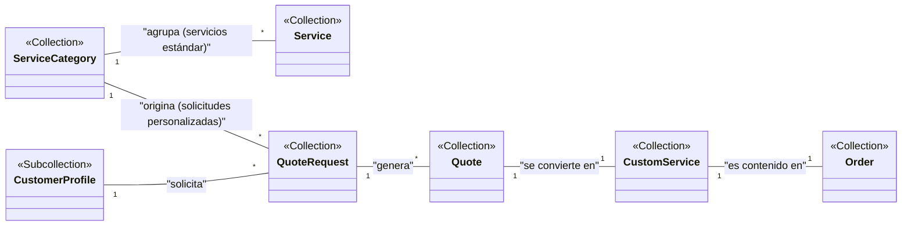

# 💻 Guía para el Equipo de Desarrollo Modelo de Base de Datos

(Todas las definiciones de colecciones existentes como users, customer_profiles, services, categories, etc., se mantienen sin cambios).

## Nueva Arquitectura para Presupuestos Personalizados

Para gestionar trabajos que no están en el catálogo estándar, se introduce un nuevo flujo de negocio y nuevas estructuras de datos.

## Flujo de Negocio

1. **Solicitud:** El cliente solicita un presupuesto para un trabajo personalizado. (Cliente crea `quote_request` con status 'pending_review')
2. **Preparación (In Progress):** El equipo de LiliApp o un profesional prepara un presupuesto detallado. (se debe crea `quotes` vinculada al request, actualiza quoteIds en `quote_request`), La solicitud (ahora con un `categoryId`) se notifica a los profesionales de esa categoría. Uno o más profesionales preparan presupuestos detallados en la colección `quotes`.
3. **Envío:** El presupuesto se presenta al cliente. (Status de `quotes`cambia a 'sent'), quien puede compararlos y aceptar uno.
4. **Decisión:** El cliente aprueba o rechaza la oferta. (status de `quotes` cambia)
5. **Conversión a Orden:** Si se acepta, el sistema genera una nueva Orden y un Servicio Personalizado. (Si acepta, se crea `custom_service` y `order`)
6. **Ejecución:** La Orden sigue el flujo normal (paid, scheduled, completed).


## Arquitectura para Presupuestos Personalizados 
Separación de responsabilidades: Cada colección tiene un propósito específico y bien delimitado:

`quote_requests` para la solicitud inicial
`quotes` para el ciclo de vida del presupuesto
`custom_services` para el servicio final
`orders` modificada para unificar ambos tipos

---


💡 Nueva Colección: `quote_requests`
Almacena la solicitud inicial del cliente, actuando como el punto de partida para uno o más presupuestos.

###  Colección 💡 `quote_requests`
```typescript
// Ruta: quote_requests/{requestId}
interface QuoteRequest {
  id: string;               // ID autogenerado de Firestore para la solicitud.  
  customerId: string;       // ID del usuario (de la colección 'users') que hizo la solicitud.
  categoryId: string;       // Referencia a la 'categories/{id}' que se solicitó.
  categoryName: string;     // Nombre de la categoría (denormalizado para fácil visualización).
  status: 'pending_review' | 'in_progress' | 'completed'; // Estado del proceso de la solicitud en general.
  description: string;      // Texto original del cliente describiendo lo que necesita.
  images?: string[];         // URLs a imágenes que el cliente adjuntó para dar contexto.
  quoteIds: string[];       // Array de IDs de presupuestos generados para esta solicitud.
  requestedAt: Timestamp;   // Fecha y hora en que el cliente envió la solicitud.
}
```

🧾 Nueva Colección: `quotes`
Será la colección central para gestionar todo el ciclo de vida de un presupuesto.

###  Colección 🧾 `quotes`
```typescript
// Ruta: quotes/{quoteId}
interface Quote {
  id: string; // ID autogenerado de Firestore para este presupuesto específico.
  requestId: string; // Referencia al ID de la 'quote_requests' original.
  categoryId: string;       // Heredado de la solicitud para enrutamiento y análisis.
  customerId: string; // ID del cliente (denormalizado para facilitar consultas).
  professionalId?: string; // ID del profesional que preparó o ejecutará el presupuesto.
  status: 'draft' | 'sent' | 'accepted' | 'rejected' | 'expired'; // Ciclo de vida de la oferta.
  
  title: string; // Título descriptivo del presupuesto (ej: "Remodelación Baño Principal").
  scopeDescription: string; // Descripción detallada del trabajo a realizar por el profesional.
  estimatedDuration?: string; // "2-3 días", útil para planificación
  
  lineItems: {
    activities: Array<{ 
      id: string; // Para referencias futuras
      description: string; // Desglose de las tareas o mano de obra.
      price: number; 
      estimatedHours?: number; // Para mejor estimación
      }>; 
    materials: Array<{ 
      id: string;
      description:string; // ej: "Desinstalar WC antiguo", "Instalar cerámica".
      quantity: number; 
      unitPrice: number; // Separar precio unitario del total
      price: number; // quantity * unitPrice 
      }>; 
  };
  
  subtotal: number;
  discount?: number;
  totalAmount: number; // El costo final y total que el cliente debe pagar.
  validUntil: Timestamp; // Fecha de expiración de esta oferta.
  
  createdAt: Timestamp; // Fecha en que se creó este documento de presupuesto.
  updatedAt: Timestamp; // Última fecha de modificación.
  convertedToOrderId?: string; // Si es aceptado, aquí se guarda el ID de la 'orders' generada.
}
```

###  Validación de estados
```typescript
// Estados válidos de Quote
type QuoteStatusTransitions = {
  'draft': ['sent', 'rejected'];
  'sent': ['accepted', 'rejected', 'expired'];
  'accepted': []; // Estado final
  'rejected': []; // Estado final
  'expired': []; // Estado final
}
```
✨ Nueva Colección: `custom_services` 
Almacena la versión "final" de un presupuesto aceptado, que actúa como un servicio único.

###  Colección ✨ `custom_services` 
```typescript
// Ruta: custom_services/{customServiceId}
interface CustomService {
  id: string; // ID autogenerado de Firestore.
  quoteId: string; // Referencia a la 'quotes' que originó este servicio.
  customerId: string; // ID del cliente.
  categoryId: string;       // Heredado para análisis de BI (ej: ¿Qué categorías generan más trabajos personalizados?).
  name: string; // Nombre del servicio para mostrar en la orden (ej: "Presupuesto #1180")
  description: string; // El `scopeDescription` del presupuesto original.
  price: number; // El `totalAmount` del presupuesto original.
  details: { activities: string[]; materials: string[]; }; // Un resumen simple para referencia rápida. // ["Desinstalar WC antiguo", "Instalar cerámica"] // ["Adhesivo para cerámica", "Tubería PVC"]
  createdAt: Timestamp; // Fecha en que el presupuesto fue aceptado y se creó este servicio.
}
```

📦 Colección `orders` (Modificada)
Se actualiza para incluir ítems de servicios personalizados.
###  Colección 📦 `orders` (Modificada)
```typescript
// Ruta: orders/{orderId}
interface Order {
  // ... (id, customerId, total, status, etc. no cambian)
  
  orderType: 'standard_service' | 'custom_quote'; // <-- NUEVO CAMPO // Campo clave para diferenciar el tipo de orden.
  
  items: Array<{
     // --- Campos para servicios estándar del catálogo ---
    serviceId?: string;  // ID de la colección 'services'.
    variantId?: string;  // ID de la subcolección 'variants'.
    
    // --- Para servicios personalizados ---
    customServiceId?: string; // Apunta al ID de la colección 'custom_services'.
    lineItems?: object; // <-- NUEVO CAMPO // Copia de 'quote.lineItems' para que la orden sea un recibo autocontenido.
    
    // Campos comunes
    serviceName: string; // Nombre del servicio o del presupuesto.
    quantity: number; // Siempre 1 para presupuestos.
    price: number; // Precio final del ítem.
  }>;
  
  // ... (el resto de los campos no cambia)
}
```

🔗 Diagrama de Relaciones (Actualizado)



### El Flujo de Datos en el Nuevo Sistema


 * **Solicitud:** Se crea un nuevo documento en `quote_requests` con status: 'pending_review'.

* **Preparación:** Un admin/profesional crea un nuevo documento en `quotes` con status: 'draft', y se actualiza el `quoteIds` array en `quote_requests`, y cambia el status a 'sent'.

* **Aceptación:** El cliente hace clic en "Aceptar Presupuesto". En ese momento, tu backend:
  
	* Crea un nuevo documento en custom_services con los detalles del quote.
	* Crea un nuevo documento en orders con orderType: 'custom_quote' y un item que apunta al customServiceId recién creado.
	* Actualiza el quote original con status: 'accepted' y el convertedToOrderId.
* **Pago y Ejecución:** La nueva orden sigue el flujo normal de pago y gestión.