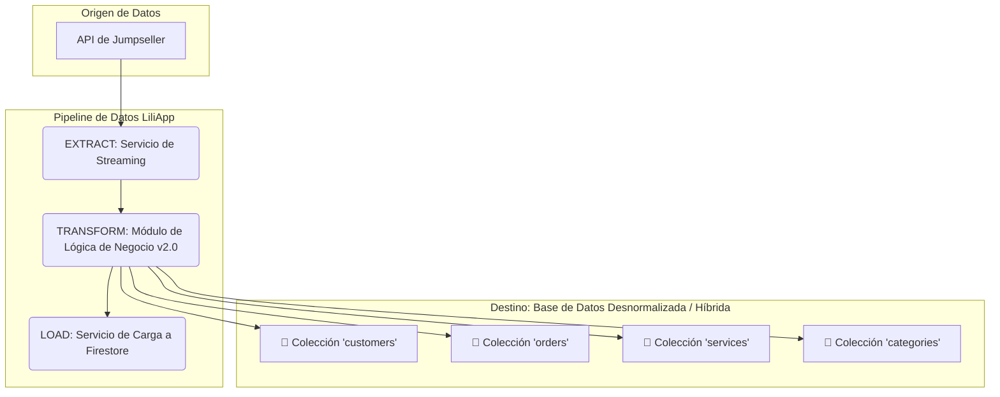
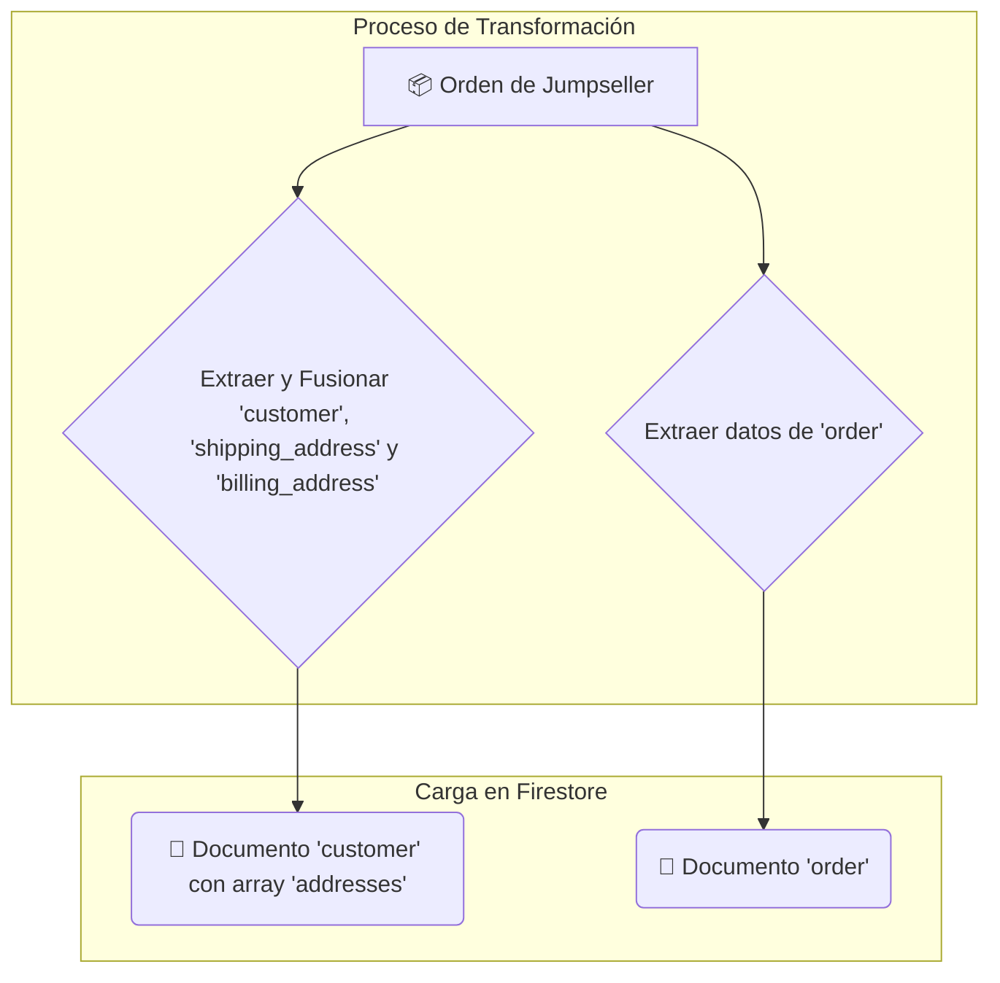

# 📄 Documento Técnico: Proceso ETL de Jumpseller a Firestore

## 📌 Visión General

Este documento describe la arquitectura y el flujo del proceso de **Extract, Transform, Load (ETL)** implementado para migrar los datos operativos de **Jumpseller** a nuestra base de datos **Google Firestore**.

El objetivo de este ETL es poblar el modelo de datos de LiliApp con información histórica y actual, permitiendo:

- Creación de perfiles de cliente enriquecidos
- Catálogo de servicios estructurado  
- Base para análisis de Business Intelligence

Esta versión (v2.0) refleja la transición hacia un **modelo de datos parcialmente desnormalizado**, optimizado para el rendimiento de lectura en los casos de uso más comunes de la aplicación, como la visualización de perfiles de cliente y detalles de servicio.

## 🚀 Arquitectura del Proceso ETL

El pipeline sigue un enfoque modular, orquestado desde el dashboard de LiliApp. La fase de **Transformación** es la encargada de generar los documentos autocontenidos.

### Componentes del Pipeline

**Extract (Extracción):** Se realiza mediante llamadas directas y en streaming a la API de Jumpseller desde nuestro backend en FastAPI. Esto garantiza que siempre trabajemos con los datos más recientes y evita timeouts en grandes volúmenes de datos.

**Transform (Transformación):** Un módulo centralizado en Python (`etl/modules/transform.py`) contiene toda la lógica que crea los nuevos modelos de documento desnormalizado (customer) e híbrido (service) a relacional de Firestore.

**Load (Carga):** Se utilizan operaciones por lotes (batch) de Firestore para cargar los datos de manera eficiente y atómica. Incluye funciones de carga "inteligentes" que pueden fusionar datos en documentos existentes (ej. añadir direcciones a un cliente) usando transacciones de Firestore.

---

## 🗺️ Mapeo de Datos: El Nuevo Modelo "Autocontenido"

A continuación, se detalla cómo las entidades de Jumpseller se deconstruyen y mapean a nuestras colecciones en Firestore.

### 1. Flujo de Datos: `Orders` de Jumpseller hacia `Customers`

Una `Order` de Jumpseller se utiliza para crear o enriquecer un único documento autocontenido en la nueva colección `customers`.

#### Origen: Objeto `order` en Jumpseller

Un objeto order de la API de Jumpseller contiene información anidada sobre el cliente, su dirección de envío y los productos comprados.

**Campos clave:** `order.id`, `order.customer`, `order.shipping_address`, `order.products`, `order.createdAt`, `order.total`

#### Destino: Colecciones y Subcolecciones en Firestore

| Colección/Subcolección | Ruta del Documento | Campos Clave y Origen | Propósito |
|------------------------|-------------------|----------------------|-----------|
| `customers` | `customers/{customer.id}` | **id, email, firstName, rut**: `customer.*`, `billing_address.taxid` **addresses** (Array): `shipping_address` | **Documento Desnormalizado**. Fusiona la información de `user`, `profile` y `addresses`. Las direcciones se almacenan como un **array de objetos** dentro de este documento para optimizar la lectura. |
| `orders` | `orders/{order.id}` | **id, customerId, total, items**: `order.*` | **Colección Normalizada**. Se mantiene separada para garantizar la escalabilidad. Se relaciona con el cliente mediante `customerId`. |

#### Diagrama de Flujo (`Order` → `Customer`)

### 2. Flujo de Datos: `Products` de Jumpseller hacia `Services`

Un **Producto** de Jumpseller se transforma en un **documento de servicio autocontenido** que utiliza un modelo **híbrido**: anida datos que no cambian (variantes) y referencias a datos que sí pueden cambiar (categorías).

#### Origen: Objeto `product` en Jumpseller

Un objeto product de la API de Jumpseller contiene información sobre el servicio, su precio, sus variantes y su árbol de categorías.

**Campos clave:** `product.id`, `product.name`, `product.categories` (array), `product.variants` (array)

#### Destino: Colecciones `services` y `categories` en Firestore

| Colección/Subcolección | Ruta del Documento | Campos Clave y Origen | Propósito |
|------------------------|-------------------|----------------------|-----------|
| `services` | `services/{product.id}` | **category** (Object): `{id: "..."}` **subcategories** (Array): `[{id: "..."}, ...]` **variants** (Array): `[{id: "...", price: ...}, ...]` | **Documento Híbrido**. Las **variantes** se anidan por completo. Las **categorías** y **subcategorías** se almacenan como un array de **referencias (solo IDs)** para mantener la consistencia de los datos. |
| `categories` | `categories/{categories[0].id}` | **id, name, description**: `product.categories[n].*` | **Colección Normalizada**. Sigue siendo la **única fuente de la verdad** para los nombres y detalles de las categorías, garantizando el mantenimiento. |

---

## ✅ Conclusión para el Equipo de Desarrollo

Las siguientes colecciones son las que han sido pobladas por el proceso ETL y deben considerarse las fuentes de datos principales para el nuevo desarrollo:

### Colecciones Principales

- **`customers`** - Nuevo modelo desnormalizado para clientes
- **`services`** - Nuevo modelo híbrido para servicios  
- **`orders`** - Sin cambios, normalizado
- **`categories`** - Sin cambios, normalizado

### Principio Arquitectónico Clave: Desnormalización Estratégica

El modelo de datos ha evolucionado para optimizar los casos de uso de lectura más frecuentes:

1. **Modelo de Cliente (`customers`):** Se ha **desnormalizado** para incluir el array de direcciones. Esto permite cargar una página de perfil de usuario con una **sola lectura** de base de datos. El equipo debe estar consciente de que la lógica de carga (`load.py`) utiliza **transacciones** para añadir nuevas direcciones a este array de forma segura.

2. **Modelo de Servicio (`services`):** Se ha adoptado un **modelo híbrido**. Las variantes se anidan, pero las categorías se **referencian por ID**. Esto garantiza que un cambio de nombre en una categoría solo requiere una actualización en la colección `categories`, manteniendo la consistencia de los datos. Para mostrar un servicio, la aplicación deberá hacer:
   - Una lectura del documento de servicio
   - Una consulta para obtener los nombres de las categorías referenciadas

